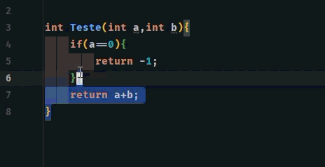
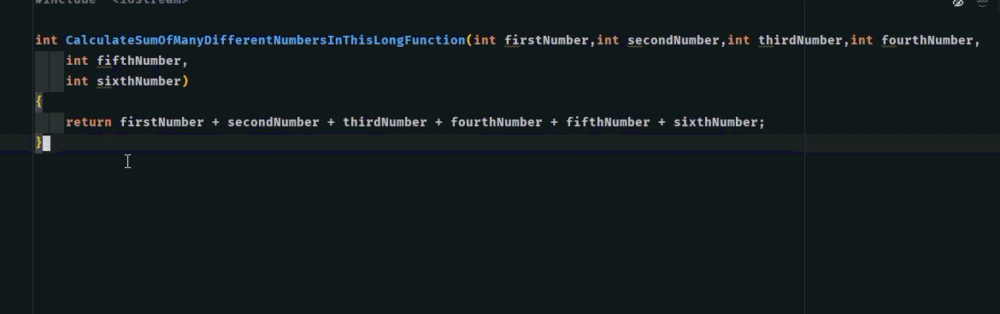
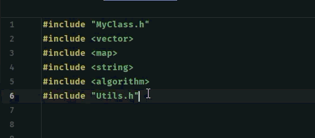

# Dotfiles

> > Currently includes configurations for **C++**.

Personal repository of development configurations and templates, reused across different projects.

## Demo

See `clang-format` in action, automatically transforming messy code:

### Basic formatting (spacing, braces, indentation)


### Long function parameters (one per line)


### Automatic include sorting


## What's inside

```
dotfiles/
├── assets/
│   ├── clang_format_a1.gif
│   ├── clang_format_a2.gif
│   └── clang_format_a3.gif
└── clang-format/
    └── cpp.clang-format    # Formatting style for C/C++ projects
```

## clang-format

C++ style configuration based on LLVM, with adjustments for professional projects:

- 4-space indentation, Allman-style braces
- Function parameters always one per line when they don't fit the column limit (makes PR review easier)
- Automatic `#include` sorting (std headers → local headers)
- No vertical alignment of `=`/declarations (avoids huge Git diffs)
- Constructor initializer lists properly formatted (`: member(value)`)

### How to use

1. Copy the desired file, for example:
   ```
   clang-format/cpp.clang-format
   ```

2. Paste it into the root of your project and **rename** it to:
   ```
   .clang-format
   ```
   > Important: the name must start with a dot and have nothing before it (`.clang-format`, not `cpp.clang-format`).

3. In CLion: **Settings → Editor → Code Style → C/C++** → select **Clang-Format** as the engine.

4. Use `Ctrl+Alt+L` to format any file in the project.
---

Maintained by [Kotz-dev](https://github.com/Kotz-dev)
